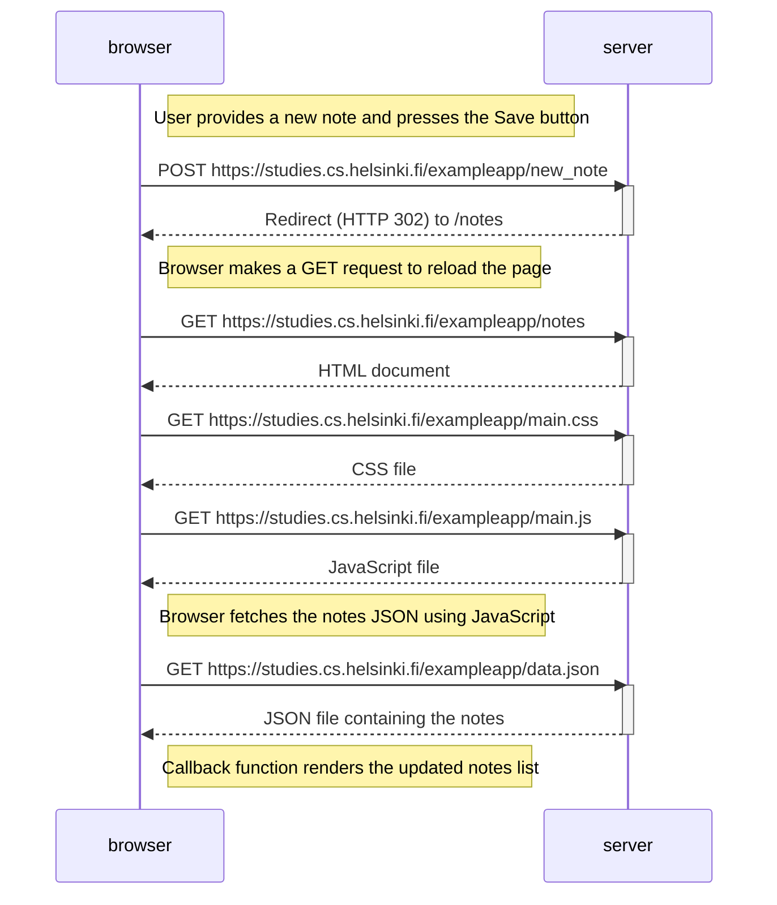

```mermaid
sequenceDiagram
  participant browser
  participant server

  Note right of browser: User provides a new note and presses the Save button

  browser->>server: POST https://studies.cs.helsinki.fi/exampleapp/new_note
  activate server
  server-->>browser: Redirect (HTTP 302) to /notes
  deactivate server

  Note right of browser: Browser makes a GET request to reload the page

  browser->>server: GET https://studies.cs.helsinki.fi/exampleapp/notes
  activate server
  server-->>browser: HTML document
  deactivate server

  browser->>server: GET https://studies.cs.helsinki.fi/exampleapp/main.css
  activate server
  server-->>browser: CSS file
  deactivate server

  browser->>server: GET https://studies.cs.helsinki.fi/exampleapp/main.js
  activate server
  server-->>browser: JavaScript file
  deactivate server

  Note right of browser: Browser fetches the notes JSON using JavaScript

  browser->>server: GET https://studies.cs.helsinki.fi/exampleapp/data.json
  activate server
  server-->>browser: JSON file containing the notes
  deactivate server

  Note right of browser: Callback function renders the updated notes list
```
