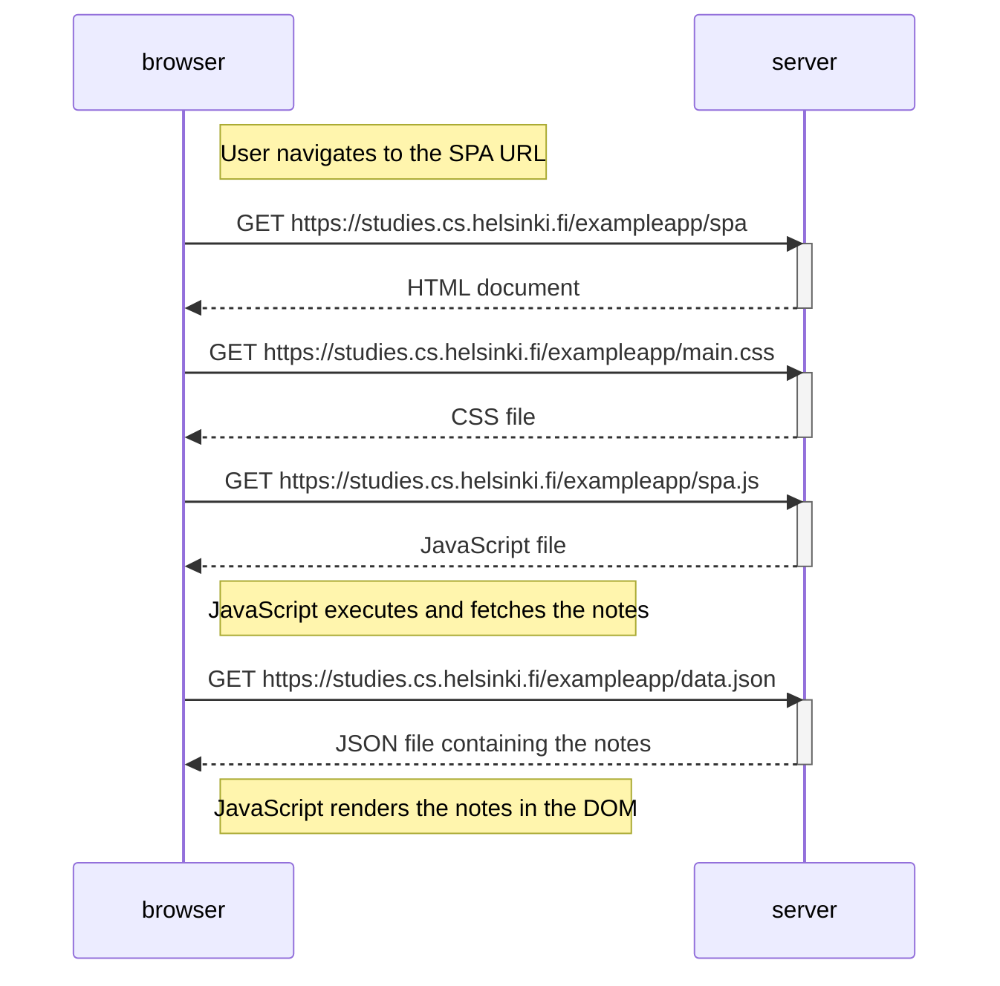

```mermaid
sequenceDiagram
  participant browser
  participant server

  Note right of browser: User navigates to the SPA URL

  browser->>server: GET https://studies.cs.helsinki.fi/exampleapp/spa
  activate server
  server-->>browser: HTML document
  deactivate server

  browser->>server: GET https://studies.cs.helsinki.fi/exampleapp/main.css
  activate server
  server-->>browser: CSS file
  deactivate server

  browser->>server: GET https://studies.cs.helsinki.fi/exampleapp/spa.js
  activate server
  server-->>browser: JavaScript file
  deactivate server

  Note right of browser: JavaScript executes and fetches the notes

  browser->>server: GET https://studies.cs.helsinki.fi/exampleapp/data.json
  activate server
  server-->>browser: JSON file containing the notes
  deactivate server

  Note right of browser: JavaScript renders the notes in the DOM
```
