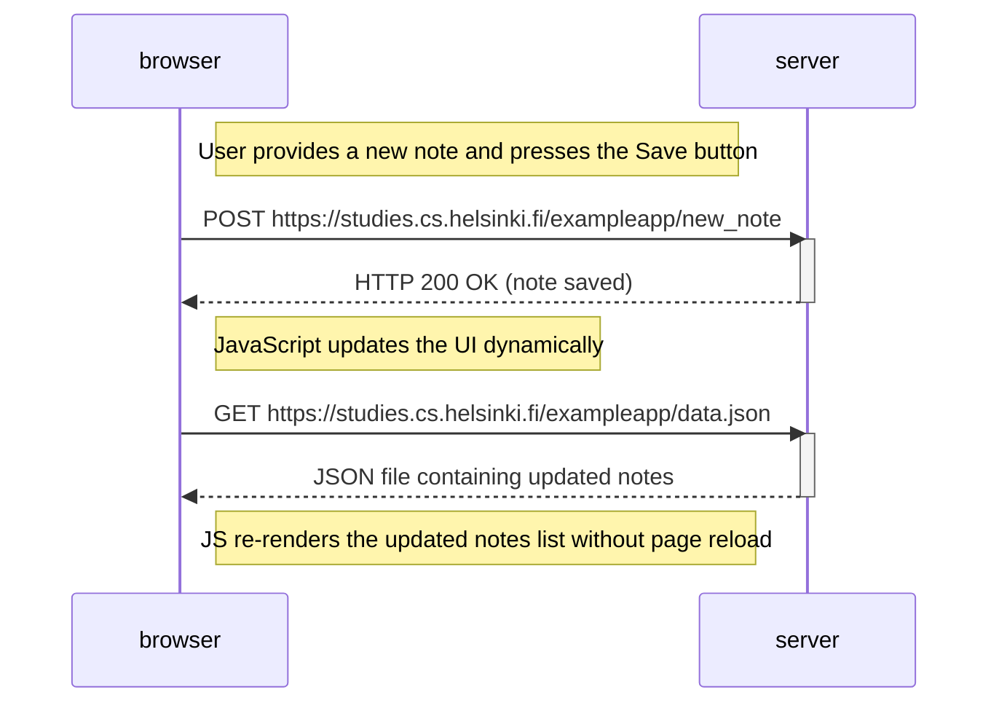

```mermaid
sequenceDiagram
  participant browser
  participant server

  Note right of browser: User provides a new note and presses the Save button

  browser->>server: POST https://studies.cs.helsinki.fi/exampleapp/new_note
  activate server
  server-->>browser: HTTP 200 OK (note saved)
  deactivate server

  Note right of browser: JavaScript updates the UI dynamically

  browser->>server: GET https://studies.cs.helsinki.fi/exampleapp/data.json
  activate server
  server-->>browser: JSON file containing updated notes
  deactivate server

  Note right of browser: JS re-renders the updated notes list without page reload
```
